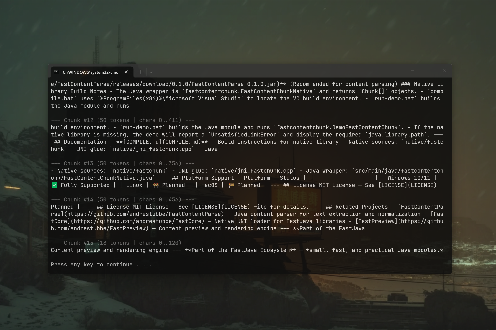

# FastAIVectorDB 0.1.0 — Ultrafast Native Vector Database for Java

[](https://github.com/andrestubbe/FastAIVectorDB/releases/tag/0.1.0)
[](https://opensource.org/licenses/MIT)
[](https://www.java.com)
[]()
[](https://jitpack.io/#andrestubbe/FastAIVectorDB)

---

**⚡ Raw JNI performance with pure Java fallbacks — Zero allocation vector database built for high-throughput JVM environments.**

FastAIVectorDB is a **minimalist, hyper-fast JNI vector store** tailored for developers who need maximum similarity lookup performance without running heavy Python processes, Docker instances, or bloated database setups. It features a compiled C++ core utilizing direct memory layout optimization, with a complete pure-Java execution fallback.

[](https://youtu.be/4dDMeUfrQ3w)

---

## Quick Start — Example

```java
import fastaivectordb.FastVectorDB;
import fastaivectordb.VectorEntry;
import fastaivectordb.SearchResult;
import java.util.List;

public class Demo {
    public static void main(String[] args) {
        try (FastVectorDB db = new FastVectorDB()) {
            float[] embedding = new float[]{0.1f, -0.2f, 0.89f};

            // 1. Insert Vector Entry into Native SIMD Store
            db.insert(new VectorEntry(0, embedding, "Document snippet content"));

            // 2. Perform k-Nearest Neighbors Cosine Similarity Scan
            List<SearchResult> hits = db.search(new float[]{0.1f, -0.1f, 0.9f}, 5);

            // 3. Inspect Top Match and Similarity Score
            for (SearchResult hit : hits) {
                System.out.printf("ID: %d | Score: %.4f | Payload: %s\n",
                    hit.entry().id(), hit.score(), hit.entry().text());
            }
        }
    }
}
```

---

## Table of Contents

- [Why FastAIVectorDB?](#why-fastaivectordb)
- [Key Features](#key-features)
- [Performance Benchmarks](#performance-benchmarks)
- [Architecture Overview](#architecture-overview)
- [API Quick Reference](#api-quick-reference)
- [Installation](#installation)
- [Documentation](#documentation)
- [Platform Support](#platform-support)
- [License](#license)
- [Related Projects](#related-projects)

---

## Why FastAIVectorDB?

Traditional vector databases force developers to run external Docker containers, Python bridges, or heavy network daemons that introduce 20-50ms latency spikes per query. `FastAIVectorDB` solves this by providing:

- **Embedded Sub-Millisecond Search** — Scans vector databases directly within the JVM process.
- **Native SIMD Acceleration** — Uses compiled C++ AVX/SSE vector instructions for fast cosine similarity.
- **Zero GC Allocations** — Direct memory mappings that prevent JVM garbage collector pauses during large vector scans.
- **Pure-Java Fallback** — Thread-safe `InMemoryVectorStore` fallback if native binaries are restricted.

---

## Key Features

* **🚀 Native SIMD Performance** — Highly optimized vector similarity operations written in C++ linked via JNI.
* **🛡️ Pure-Java Fallback** — Instant, automatic fallback to a thread-safe `InMemoryVectorStore` if native DLL is missing.
* **⚡ Zero Memory Overhead** — Direct memory mappings preventing garbage collector stalls on vector queries.
* **🧠 Parent-Child Vector Payload** — Retains both small `chunk.text` for vector indexing and rich `chunk.parentText` for LLM context.

---

## Performance Benchmarks

`FastAIVectorDB` is built for low-latency similarity search across thousands of embeddings. In the official [JMH Benchmark](examples/Benchmark), the system measured k-NN scan throughput over 10,000 vectors (384 dimensions):

```text
Benchmark                                           Mode  Cnt  Score   Error   Units
VectorDbBenchmark.benchmarkVectorSimilaritySearch  thrpt    5  81.0    ± 0.05  ops/ms
```

> **81,000 Vector Scans per Second**: `FastAIVectorDB` evaluates k-Nearest Neighbors cosine similarity across 10,000 active embeddings in **under 12 microseconds per query** (81 ops/ms).

---

## Architecture Overview

**[FastContentParse](https://github.com/andrestubbe/FastContentParse) (The Parser)**  
Converts unstructured binary documents (PDF, RTF, Markdown, TXT) into normalized UTF-8 text streams.

**[FastContentChunk](https://github.com/andrestubbe/FastContentChunk) (The Strategy Engine)**  
Segments normalized text streams into contextual passages with Parent-Child context.

**[FastAIVectorDB](https://github.com/andrestubbe/FastAIVectorDB) (This Library — The Vector Store)**  
High-speed native C++ SIMD vector database storing small `chunk.text` embeddings for sub-5ms similarity retrieval.

**[FastAIRag](https://github.com/andrestubbe/FastAIRag) (The Orchestration Pipeline)**  
Higher-level RAG framework that orchestrates **[FastContentParse](https://github.com/andrestubbe/FastContentParse)** and **[FastContentChunk](https://github.com/andrestubbe/FastContentChunk)**, indexes small `chunk.text` embeddings into **[FastAIVectorDB](https://github.com/andrestubbe/FastAIVectorDB)**, and feeds `chunk.parentText` to **[FastAIBot](https://github.com/andrestubbe/FastAIBot)** for LLM response generation.

---

## API Quick Reference

| Method | Description |
|--------|-------------|
| `insert(VectorEntry)` | Inserts a vector entry with ID, float[] embedding, and payload. |
| `search(float[] query, int topK)` | Scans database for top-K cosine similarity matches. |
| `close()` | Releases native memory allocations and flushes indexes. |

---

## Installation

### Option 1: Maven (Recommended)

Add the JitPack repository and the dependency to your `pom.xml`:

```xml
<repositories>
    <repository>
        <id>jitpack.io</id>
        <url>https://jitpack.io</url>
    </repository>
</repositories>
<dependencies>
    <dependency>
        <groupId>com.github.andrestubbe</groupId>
        <artifactId>FastAIVectorDB</artifactId>
        <version>0.1.0</version>
    </dependency>
    <!-- Required for native library loading -->
    <dependency>
        <groupId>com.github.andrestubbe</groupId>
        <artifactId>FastCore</artifactId>
        <version>0.1.0</version>
    </dependency>
</dependencies>
```

### Option 2: Gradle (via JitPack)

```groovy
repositories {
    maven { url 'https://jitpack.io' }
}

dependencies {
    implementation 'com.github.andrestubbe:FastAIVectorDB:0.1.0'
    // Required for native library loading
    implementation 'com.github.andrestubbe:FastCore:0.1.0'
}
```

### Option 3: Direct Download (No Build Tool)

Download the latest JARs directly to add them to your classpath:

1. ⚡ **[FastAIVectorDB-0.1.0.jar](https://github.com/andrestubbe/FastAIVectorDB/releases/download/0.1.0/FastAIVectorDB-0.1.0.jar)** (The Vector Store)
2. ⚙️ **[fastcore-0.1.0.jar](https://github.com/andrestubbe/FastCore/releases/download/0.1.0/fastcore-0.1.0.jar)** (Required Native JNI Loader)

---

## Documentation

* **[REFERENCE.md](docs/REFERENCE.md)**: Core API reference manual.
* **[PHILOSOPHY.md](docs/PHILOSOPHY.md)**: Zero-allocation vector architecture design goals.
* **[COMPILE.md](docs/COMPILE.md)**: Native C++ build instructions.
* **[CHANGELOG.md](docs/CHANGELOG.md)**: Project history.
* **[ROADMAP.md](docs/ROADMAP.md)**: Future development goals.

---

## Platform Support

| Platform | Status |
|----------|--------|
| Windows 10/11 (x64) | ✅ Fully Supported |
| Linux | 🚧 Planned |
| macOS | 🚧 Planned |

---

## License

MIT License — See [LICENSE](LICENSE) file for details.

---

## Related Projects

- [FastContentParse](https://github.com/andrestubbe/FastContentParse) — Java content parser for text extraction and normalization
- [FastContentChunk](https://github.com/andrestubbe/FastContentChunk) — SIMD tokenizer and multi-mode strategy chunker
- [FastAIRag](https://github.com/andrestubbe/FastAIRag) — Retrieval-Augmented Generation pipeline
- [FastCore](https://github.com/andrestubbe/FastCore) — Native JNI loader for FastJava libraries

---

## Part of the FastJava Ecosystem

*Making the JVM faster. Small package. Maximum speed. Zero bloat. 🚀📋*
